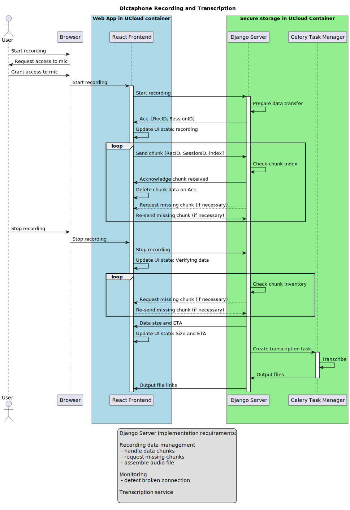

# Dictaphone
The dictaphone application is designed to continuously transmit recording data through a customized WebSocket implementation. 
This ensures that there will not be any cached sensitive data in the browser, but only momentarily in the Javascript memory.
Reliable Data Transfer has been implemented by use of acknowledgment of data packets and package request/re-send functionality. 
Also, a custom header is prefixed on the client side for binary data packets, and this header is stripped on the server side to ensure package order integrity. 
Transcription of recordings is done using the Transcriber project. Transcriptions are started as Celery tasks. 

## Sequence diagram - user and component interaction


## Python packages needed
``` bash
pip install django django-cors-headers django-rest-framework celery redis channels_redis python-dotenv channels daphne pytest pytest-asyncio
```

## npm packages needed
``` bash
npm install extendable-media-recorder extendable-media-recorder-wav-encoder
```

## Prepare Django backend.
Create an environment file for test in the "dictaphone" project directory called ".env" with the following content
```
SECRET_KEY='django-insecure-1t2i)9v^1^n$4@_w72wlb$71r)=o1(kg2lnma-!fni9*ei#y75'
DEBUG=True
```

## Start daphne server for serving WebSocket (activate Python env)
``` bash
daphne -p 8001 backend.asgi:application
```

## Start development react frontend
``` bash
nikko@nikkoAtClaaudia:~/projects/dictaphone/frontend$ npm run dev --host
```

## Run unit test
``` bash
(.venv) nikko@nikkoAtClaaudia:~/projects/dictaphone$ python -m unittest dictaphone/test_audio_chunk_manager.py
```

## Run integration test
``` bash
(.venv) nikko@nikkoAtClaaudia:~/projects/dictaphone$ pytest -v --ignore=dictaphone/aau-whisper/
```

## Checkout and install the transcriber Python application
``` bash
cd dictaphone
git clone --depth 1 --single-branch --recursive --shallow-submodules -b "V1.12" https://github.com/aau-claaudia/transcriber.git aau-whisper
pip install --no-cache-dir numpy==1.26.4
pip install --no-cache-dir faster-whisper==1.0.0
cd aau-whisper
pip install -r requirements.txt
pip install -e .
```

## Start Celery worker and configure to run one task at a time from the queue (activate Python env)
``` bash
(.venv) nikko@nikkoAtClaaudia:~/projects/dictaphone$ python -m celery -A backend worker -l info --concurrency=1
```